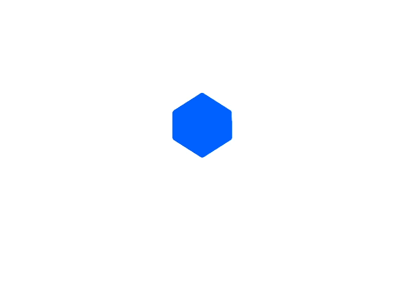

<div align="center" id="top">
    
    <br>
    <a href="https://miguelrisquelme-uiclone-dropbox.netlify.app">Demo  ➤</a>
</div>

<h1 align="center">UI Clone Dropbox</h1>

<p align="center">
  

  

  

  

  

  

  
</p>

<br>

## :dart: About

Dropbox is a service for storing and sharing files. It is based on the concept of "cloud computing". It belongs to Dropbox Inc., based in San Francisco, California, USA. The company that developed the program provides computer centers that store its customers' files.

## :rocket: Technologies

The following tools were used in this project:

- [React](https://pt-br.reactjs.org/)
- [TypeScript](https://www.typescriptlang.org/)

## :white_check_mark: Requirements

Before starting :checkered_flag:, you need to have [Git](https://git-scm.com) and [Node](https://nodejs.org/en/) installed.

## :checkered_flag: Starting

```bash
# Clone this project
$ git clone https://github.com/miguelrisquelme/uiclone-dropbox.git

# Access
$ cd uiclone-dropbox

# Install dependencies
$ yarn install

# Run the project
$ yarn start

# The server will initialize in the <http://localhost:3000>
```

## :memo: License

This project is under license from MIT. For more details, see the [LICENSE](LICENSE.md) file.

Made with :heart: by <a href="https://github.com/miguelrisquelme" target="_blank">Miguel Riquelme</a>

&#xa0;

<a href="#top">Back to top</a>
